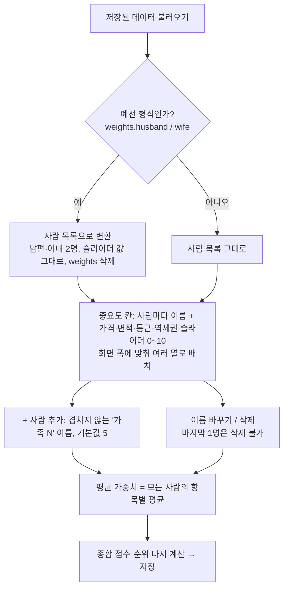

# 인원별 가중치

남편·아내 2명 고정이던 중요도를 사람 목록(`state.people = [{ id, name, w: { price, area, commute, station } }]`)으로 바꿨다.
처음 시작은 남편·아내 2명. 평균은 모든 사람을 같은 비중으로 계산한다.

```mermaid
flowchart TD
    A[저장된 데이터 불러오기] --> B{예전 형식인가?<br/>weights.husband / wife}
    B -- 예 --> C[사람 목록으로 변환<br/>남편·아내 2명, 슬라이더 값 그대로, weights 삭제]
    B -- 아니오 --> D[사람 목록 그대로]
    C --> E
    D --> E[중요도 칸: 사람마다 이름 + 가격·면적·통근·역세권 슬라이더 0~10<br/>화면 폭에 맞춰 여러 열로 배치]
    E --> F[+ 사람 추가: 겹치지 않는 '가족 N' 이름, 기본값 5]
    E --> G[이름 바꾸기 / 삭제<br/>마지막 1명은 삭제 불가]
    F --> H
    G --> H[평균 가중치 = 모든 사람의 항목별 평균] --> I[종합 점수·순위 다시 계산 → 저장]
```
