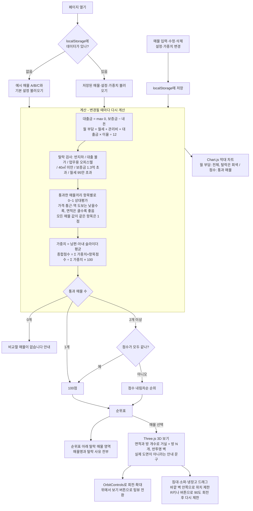

# 신혼부부 전월세 비교 — 흐름도

단일 파일 `index.html`. 금액 단위는 만원.

```mermaid
flowchart TD
    A[페이지 열기] --> B{localStorage에<br/>데이터가 있나?}
    B -- 없음 --> C[예시 매물 A/B/C와<br/>기본 설정 불러오기]
    B -- 있음 --> D[저장된 매물·설정·가중치 불러오기]
    C --> E
    D --> E

    subgraph E[계산 - 변경될 때마다 다시 계산]
      E1[대출금 = max 0, 보증금 − 내 돈<br/>월 부담 = 월세 + 관리비 + 대출금 × 이율 ÷ 12]
      E2[탈락 검사: 반지하 / 대출 불가 / 업무용 오피스텔<br/>/ 40㎡ 미만 / 보증금 1.3억 초과 / 월세 95만 초과]
      E3[통과한 매물끼리 항목별로 0~1 상대평가<br/>가격·통근·역 도보는 낮을수록, 면적은 클수록 좋음<br/>모든 매물 값이 같은 항목은 1점]
      E4[가중치 = 남편·아내 슬라이더 평균<br/>종합점수 = Σ 가중치×항목점수 ÷ Σ 가중치 × 100]
      E5{통과 매물 수}
      E1 --> E2 --> E3 --> E4 --> E5
    end

    E5 -- 0개 --> F0[비교할 매물이 없습니다 안내]
    E5 -- 1개 --> F1[100점]
    E5 -- 2개 이상 --> F2{점수가 모두 같나?}
    F2 -- 예 --> F1
    F2 -- 아니오 --> F3[점수 내림차순 순위]
    F1 --> R[순위표]
    F3 --> R
    R --> X[순위표 아래 탈락 매물 영역<br/>매물명과 탈락 사유 전부]
    E --> G[Chart.js 막대 차트<br/>월 부담: 전체, 탈락은 회색 / 점수: 통과 매물]

    R -- 매물 선택 --> H[Three.js 3D 보기<br/>면적과 방 개수로 거실 + 방 N개, 반투명 벽<br/>실제 도면이 아니라는 안내 문구]
    H --> I[OrbitControls로 회전·확대<br/>위에서 보기 버튼으로 탑뷰 전환]
    H --> J[침대·소파·냉장고 드래그<br/>바깥 벽 안쪽으로 위치 제한<br/>R키나 버튼으로 90도 회전 후 다시 제한]

    K[매물 입력·수정·삭제<br/>설정·가중치 변경] --> L[localStorage에 저장] --> E
```
