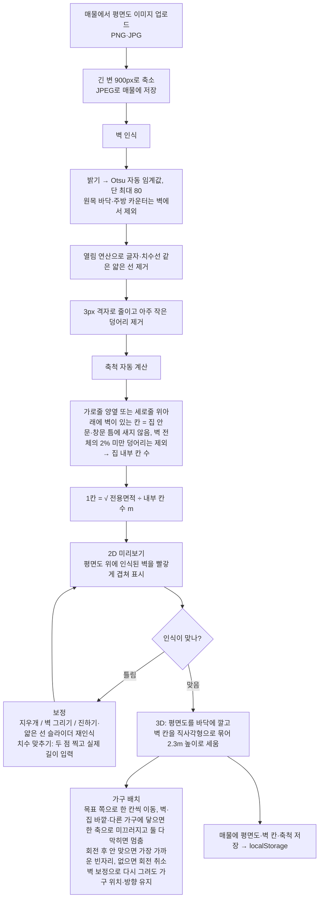

# 평면도 → 3D (A안: 브라우저 이미지 처리)

평면도가 없는 매물은 기존 "면적 기준 대략 구조"를 그대로 쓴다.

```mermaid
flowchart TD
    A[매물에서 평면도 이미지 업로드<br/>PNG·JPG] --> A1[긴 변 900px로 축소<br/>JPEG로 매물에 저장]
    A1 --> B[벽 인식]
    B --> B1[밝기 → Otsu 자동 임계값, 단 최대 80<br/>원목 바닥·주방 카운터는 벽에서 제외]
    B1 --> B2[열림 연산으로 글자·치수선 같은 얇은 선 제거]
    B2 --> B3[3px 격자로 줄이고 아주 작은 덩어리 제거]
    B3 --> C[축척 자동 계산]
    C --> C1[가로줄 양옆 또는 세로줄 위아래에 벽이 있는 칸 = 집 안<br/>문·창문 틈에 새지 않음, 벽 전체의 2% 미만 덩어리는 제외<br/>→ 집 내부 칸 수]
    C1 --> C2[1칸 = √ 전용면적 ÷ 내부 칸 수 m]
    C2 --> D[2D 미리보기<br/>평면도 위에 인식된 벽을 빨갛게 겹쳐 표시]
    D --> E{인식이 맞나?}
    E -- 틀림 --> F[보정<br/>지우개 / 벽 그리기 / 진하기·얇은 선 슬라이더 재인식<br/>치수 맞추기: 두 점 찍고 실제 길이 입력]
    F --> D
    E -- 맞음 --> G[3D: 평면도를 바닥에 깔고<br/>벽 칸을 직사각형으로 묶어 2.3m 높이로 세움]
    G --> H[가구 배치<br/>목표 쪽으로 한 칸씩 이동, 벽·집 바깥·다른 가구에 닿으면 한 축으로 미끄러지고 둘 다 막히면 멈춤<br/>회전 후 안 맞으면 가장 가까운 빈자리, 없으면 회전 취소<br/>벽 보정으로 다시 그려도 가구 위치·방향 유지]
    G --> I[매물에 평면도·벽 칸·축척 저장 → localStorage]
```
